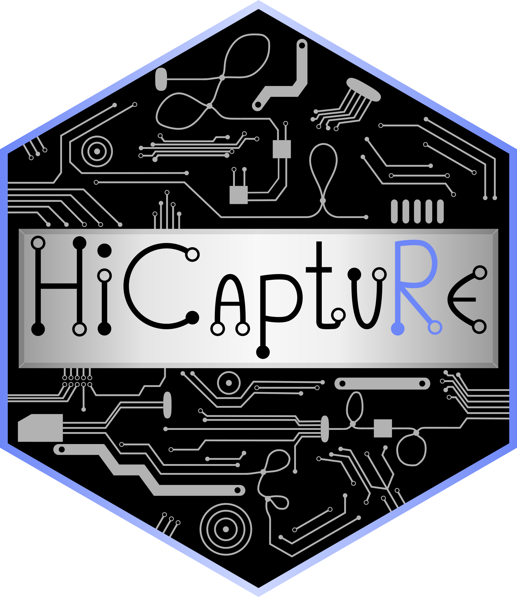

# HiCaptuRe 
R package for Capture Hi-C data management. HiCaptuRe is an R package developed in [Javierre Lab](https://www.javierrelab.com/) to deal with Capture Hi-C data, specially data from [liCHi-C](https://www.nature.com/articles/s41467-023-35911-8).
It's an on going project so it still being developed but it's fully functional, new functions will be coming up soon.

## Installation

You can install the latest release of `HiCaptuRe` from Bioconductor:

    if (!requireNamespace("BiocManager", quietly = TRUE))
        install.packages("BiocManager")
    
    BiocManager::install("HiCaptuRe")

If you want to test the development version, you can install it from the github repository:

    BiocManager::install("LaureTomas/HiCaptuRe")

Now you can load the package using `library(HiCaptuRe)`.
