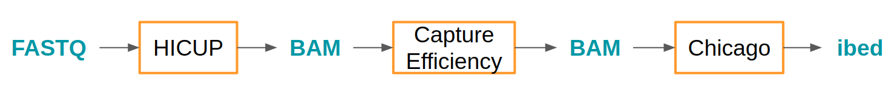

```{r setup, include = FALSE}
knitr::opts_chunk$set(
  collapse = TRUE,
  comment = "#>"
)
```

# Introduction

Welcome to HiCaptuRe, an R package for Capture Hi-C data management. In this vignette we will see the usage of all the functions of this package and some practical examples.

Before going into the actual functions of the package we first need to know were our data come from. Since we are interested in Capture Hi-C data, our final output will be pairs of regions of the genome that are in physical proximity, creating what we call an interaction or DNA loop.

## 1. Basic vocabulary

**Restriction fragment**: when the genome is digested by a restriction enzyme, which recognize an specific motif in the DNA, the result is the entire genome cut into pieces, these pieces are called restriction fragments

**Hi-C**: briefly it's a 3C technique which allow to detect the interaction frequency between all the restriction fragments of the genome

**Capture Hi-C**: it's a variation of Hi-C where we enrich the library for specific interactions using designed oligos that hibridize with our regions of interest, therefore enriching the library in interactions containing at least one regions of interest.

**Bait**: it's any restriction fragment that we capture in Capture Hi-C, meaning, any restriction fragment that contains some feature of interest, i.e. promoters.

**Other-end**: They are the restriction fragments that are not captured, so the non bait fragments.

**Interactome**: It's the whole set of interactions detected in a given sample

**Anchor**: Each of the restriction fragments involved in an interaction

## 2. Where does my data come from?

If you don't know already what is Capture Hi-C (especially Promoter CHi-C and liCHi-C), here you can find some literature about it and how to analyse them:

-   [Promoter Capture Hi-C: High-resolution, Genome-wide Profiling of Promoter Interactions](https://www.ncbi.nlm.nih.gov/pmc/articles/PMC6102006/pdf/jove-136-57320.pdf)

-   [Detecting chromosomal interactions in Capture Hi-C data with CHiCAGO and companion tools](nature.com/articles/s41596-021-00567-5)

-   [Low input capture Hi-C (liCHi-C) identifies promoter-enhancer interactions at high-resolution](https://www.nature.com/articles/s41467-023-35911-8)

Basically the idea behind any Capture Hi-C technique is to enrich the Hi-C library in specific baits (i.e. promoters) using designed oligos, to increase the resolution of Hi-C and finally obtaining interactions at the restriction-fragment resolution.

There are several softwares that can be used to perform the preprocessing of this type of data and to call significant interactions. The workflow that we follow is represented below:



Once the libraries are sequenced we analyse the FASTQ files with HICUP, which aligns our data to the reference genome and removes several artefacts of the technique. Once we get our filtered BAM file from HICUP, we calculate the capture efficiency of the protocol and we only select those paired reads that are captured at least at one end. Finally, we run the Chicago pipeline, which performs the interactions calling based on the distributions of reads around our baits.

## 3. Main Chicago Outputs

When you run Chicago you can get the results in 3 different formats:

#### **washU_text**

```         
##                  V1                  V2   V3  
## chr20,119103,138049 chr20,523682,536237 6.00  
## chr20,161620,170741   chr20,73978,76092 5.17  
## chr20,233983,239479 chr20,206075,209203 5.35  
```

-   It's the format used to upload your data to the [WashU Browser](https://epigenomegateway.wustl.edu/)\
-   It consists in 3 columns: coordinates of the first end, coordinates of the second end and Chicago score.

#### **seqMonk**

```         
## V1     V2     V3      V4 V5   V6
## 20 119103 138049 DEFB126  6 6.00
## 20 523682 536237 CSNK2A1  6 6.00
## 20 161620 170741 DEFB128 16 5.17  
## 20  73978  76092       . 16 5.17
```

-   It's the format used to upload your data to the [seqMonk](https://www.bioinformatics.babraham.ac.uk/projects/seqmonk/) software developed in the Babraham Institute.
-   An interaction is represented by two rows: the first row is the bait, the second the other end\
-   It consists of 6 columns: chromosome, start, end, annotation, read number and Chicago score.

#### **interBed - ibed**

```         
##   bait_chr bait_start bait_end                  bait_name otherEnd_chr
## 1       20     119103   138049                    DEFB126           20
## 2       20     161620   170741                    DEFB128           20
##   otherEnd_start otherEnd_end otherEnd_name N_reads score
## 1         523682       536237       CSNK2A1       6  6.00
## 2          73978        76092             .      16  5.17
```

-   It's the most standard format
-   Each row represents an interaction
-   First 4 columns give information about the chromosome, start, end and name of the bait fragment
-   Next 4 columns give information about the chromosome, start, end and name of the other end that interacts with the bait fragment
-   N_reads is the number of reads
-   Score is the Chicago score

For more information check the Chicago package [vignette](https://www.bioconductor.org/packages/release/bioc/vignettes/Chicago/inst/doc/Chicago.html) or its [bitbucket](https://bitbucket.org/chicagoTeam/chicago/src/master/).

### 3.1. Extra Chicago Output

#### **peakmatrix**

To obtain this output you need to run the script `makePeakMatrix.R` from the Chicago Tools available in its bitbucket.

```         
##   baitChr baitStart baitEnd baitID                        baitName oeChr oeStart   oeEnd oeID
## 1       1    896515  912788    237 ENST00000448179,ENST00000607769     1  915239  938701  239
## 2       1    896515  912788    237 ENST00000448179,ENST00000607769     1  954044  968260  242
## 3       1    896515  912788    237 ENST00000448179,ENST00000607769     1  968261  992014  243

##    oeName
## 1    ENST00000616016,ENST00000618323,ENST00000437963,ENST00000342066,ENST00000616125,ENST00000618779,ENST00000622503,ENST00000618181,ENST00000617307,ENST00000341065,ENST00000609207,ENST00000417705,ENST00000432961
## 2    ENST00000379410,ENST00000379407,ENST00000379409,ENST00000338591,ENST00000622660,ENST00000463212,ENST00000466300,ENST00000481067,ENST00000327044,ENST00000477976,ENST00000487214,ENST00000469563
## 3    ENST00000480267,ENST00000491024,ENST00000341290,ENST00000479361,ENST00000433179

##       dist    sample1   sample2    sample3    sample4
## 1    22319 49.7986643 30.740077 34.5393049 13.1090636
## 2    56501  6.4405107  2.914006  2.3147820  0.3678843
## 3    75486 11.1285715  8.785398  9.4215783  2.9546315
```

-   Each row represents an interaction
-   First 5 columns give information about the chromosome, start, end, restriction fragment ID and name of the bait fragment
-   Next 5 columns give information about the chromosome, start, end, restriction fragment ID and name of the other end that interacts with the bait fragment
-   dist is the distance of the interaction
-   extra columns with the Chicago score in each sample

## 4. Example data

In this package you can find several example data files to play around with HiCaptuRe.

These example files came from liCHi-C data using a promoter capture approach.

-   **ibed1_example.ibed** and **ibed2_example.ibed**: output of Chicago in ibed format
-   **annotation_example.txt**: annotation file for each HindIII fragment with gene_name
-   **regions_example.bed**: bed file with regions obtained from some omic analysis (ChIP-seq, ATAC-seq,...)
